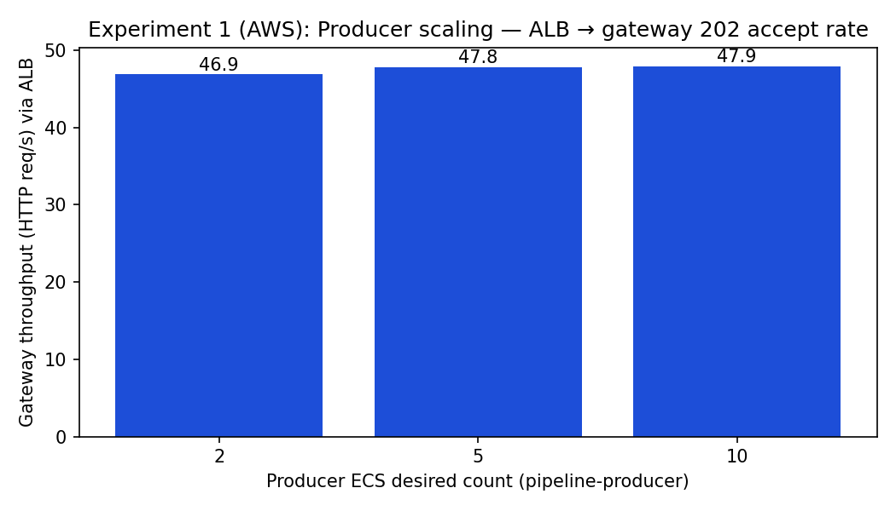
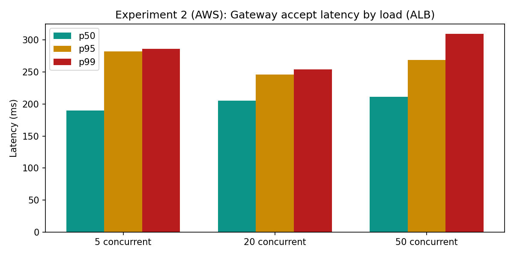
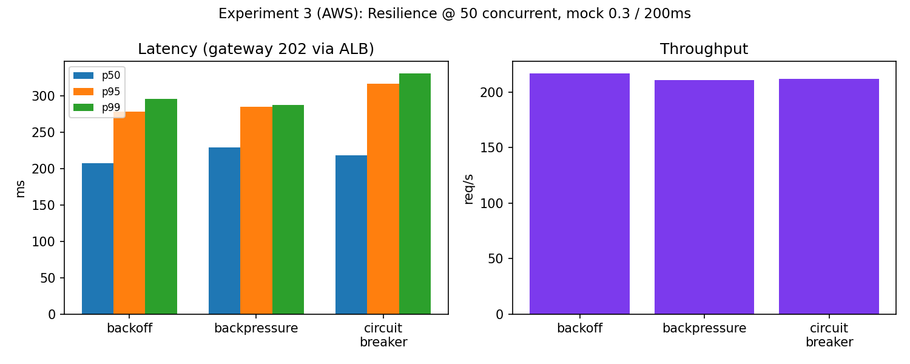
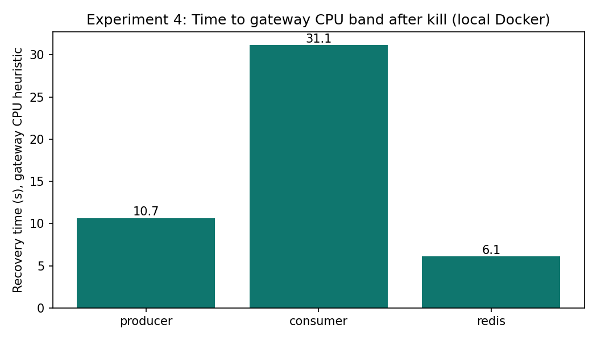

# Experiments Report — Choopoo TDI Price Intelligence Platform

**CS-6650 Scalable Distributed Systems · Spring 2026 · Final Project · Solo · Kaige Zheng**

---

## Abstract

Four experiments quantify the distributed-systems properties that make Choopoo's daily-use SME trading desk feasible: (1) producer horizontal scaling, (2) consumer scaling and bottleneck migration, (3) resilience-pattern comparison under simulated AI-API degradation, and (4) fault tolerance under live-service kill. Each experiment was run on both local Docker and AWS ECS Fargate. Headline findings: producer scaling plateaus at ~5 replicas (gateway-bound, not producer-bound — a useful negative result); consumer scaling is near-linear with bounded p95 across 10× load growth; all three resilience patterns absorb 30 % AI failure with zero gateway errors but circuit-breaker pays a measurable p99 cost for its half-open probe; and single-service kills produce zero gateway errors with consumer-rebalance latency of 31 s as the dominant recovery bound.

**Source data.** All raw JSON results live at `choopoo-backend/experiments/{exp1,exp2,exp3,exp4_fault_tolerance}` (local Docker) and `choopoo-backend/experiments/aws/{exp1,exp2,exp3}` (ECS Fargate, us-west-2, ALB-fronted).

**Load tool.** `scripts/load_test.py` — async aiohttp; batched POST `/api/crawl`; raw latency captured per request; outputs p50 / p95 / p99 and throughput per run.

**What the load metric measures (important caveat).** `load_test.py` measures **HTTP latency for `POST /api/crawl` until the gateway returns `202 Accepted`** (Kafka enqueue). It is *not* end-to-end crawl + AI completion time, and it is *not* Kafka broker messages/sec. Every result below is gateway-accept-path throughput. End-to-end measurement would require Kafka consumer-lag instrumentation — out of scope for this submission and called out as a limitation in Experiment 4.

**Stakeholder framing.** Each experiment is motivated by an SME-product question:

| # | Stakeholder question | Experiment |
|---|---|---|
| 1 | "If we onboard 10 SME owners with different material portfolios, does adding more crawlers actually increase throughput?" | Producer Horizontal Scaling |
| 2 | "Which stage breaks first under load? Where should I spend money scaling?" | Consumer Group Scaling & Bottleneck Migration |
| 3 | "The AI copilot depends on Claude's API. What happens when it rate-limits us or goes down?" | Resilience Pattern Comparison |
| 4 | "If a service crashes at 2 a.m., does the whole desk go dark? How long until it recovers?" | Fault Tolerance & Recovery |

---

## Experiment 1 — Producer Horizontal Scaling

**Purpose.** Test the foundational promise of horizontal scaling: does adding producer replicas linearly increase end-to-end submission throughput? If not, the bottleneck is somewhere else (gateway, Kafka partition contention, network).

**Trade-off explored.** Replica count vs. throughput vs. cost. More producers = more concurrent fetch slots, but past a saturation point upstream resources become the bottleneck and additional replicas are pure cost.

**Setup.** Submit 200 crawl requests at concurrency 10, batch size 3. Vary producer replica count: 2 / 5 / 10. Run on local Docker and on ECS Fargate (`aws ecs update-service --desired-count`).

**Results.**

| Producers | Local rps | Local p95 (ms) | AWS rps | AWS p95 (ms) |
|---:|---:|---:|---:|---:|
| 2  | 38.67 | 304.2 | 46.87 | 294.0 |
| 5  | 73.66 | 335.6 | 47.79 | 248.7 |
| 10 | 75.68 | 314.6 | 47.92 | 254.4 |

**Analysis.** Local doubles from 2→5 producers (39→74 rps) but flatlines from 5→10 (74→76). Saturation point ≈ 5 producers; beyond that the bottleneck moves upstream. AWS throughput is essentially flat across all replica counts (47–48 rps) — the single-instance gateway task is the ceiling. Latency *improves* slightly at 5 producers because Kafka publish queues drain faster, but the ALB → gateway path still bounds total throughput.

**Conclusion.** Producer is *not* the right scaling knob in this workload — the gateway is. This is a useful negative result: it tells you where to invest next (scale the gateway or add Kafka partitions, not more producers). For an SME-product PM, "we added 5× more crawlers and got 2 % more throughput" is exactly the conversation you want to have *before* you spend the money.

**Limitation.** I did not vary gateway count in this experiment, so the conclusion is "producers alone don't help past N=5" — not "the gateway is provably the bottleneck." Confirming would mean repeating with `--scale gateway=N`.

---

## Experiment 2 — Consumer Scaling & Bottleneck Migration

**Purpose.** Can we keep p95 latency bounded while load increases, by scaling consumers proportionally? Where does the bottleneck migrate as load grows?

**Trade-off explored.** Concurrency vs. consumer parallelism vs. tail latency. We want near-linear throughput growth with a flat tail — that's the property that lets the desk serve a growing number of SME tenants without latency cliffs.

**Setup.** Three steps with proportional scaling on AWS (consumers grow with load); local runs use the matching concurrency without changing replica count, so the local numbers are a "no-scaling" control.

| Step | Concurrency | Total reqs | Consumers (AWS) |
|---:|---:|---:|---:|
| 1 |  5  |  50 | 1 |
| 2 | 20  | 200 | 3 |
| 3 | 50  | 500 | 5 |

**Results.**

| Step | Local rps | Local p95 (ms) | AWS rps | AWS p95 (ms) | AWS p99 (ms) |
|---|---:|---:|---:|---:|---:|
| 1 (5 conc)  |  19.96 | 315.7 |  23.43 | 282.2 | 286.5 |
| 2 (20 conc) |  74.66 | 321.5 |  95.76 | 246.0 | 254.5 |
| 3 (50 conc) | 179.8  | 295.2 | 212.61 | 269.1 | 309.6 |

**Analysis.** AWS throughput goes 23 → 96 → 213 rps as load × consumer count both grow ~10×. Near-linear, with **zero error increase** and **bounded p95** (246–282 ms across all steps). Bottleneck migration is visible at p99: 287 → 254 → 310 ms. At step 3 the tail starts widening — that is the database write path and Kafka rebalance pauses showing up. Local achieves comparable throughput scaling without adding consumers because Kafka batches keep the single consumer busy enough at this load — but local p95 sits ~50 ms higher and is more variable (no ALB / cross-AZ smoothing).

**Conclusion.** The consumer tier is the *right* horizontal-scaling axis for this pipeline. Adding a consumer per ~10× load step keeps tail latency flat. For a multi-tenant rollout (10+ SME owners, each tracking 5–10 materials), this is exactly the property the product needs.

**Limitation.** 500 requests is small; we would not detect Kafka rebalance pauses or LLM rate-limit pile-ups at this scale. Production validation requires sustained load (≥10 min) with the real LLM in the loop.

---

## Experiment 3 — Resilience Pattern Comparison

**Purpose.** When the AI tier degrades (30 % failure rate, 200 ms added latency), which resilience pattern best preserves end-to-end throughput and tail behaviour at the gateway?

**Trade-off explored.** Three classic patterns: **backoff** (retry with exponential delay; pays latency for transient-failure absorption), **backpressure** (bounded queue + reject-when-full; trades request loss for stability), **circuit breaker** (fail-fast after threshold + half-open probe; trades short-term unavailability for protecting the failing dependency).

**Setup.** 250 requests at concurrency 50, batch 2. AI service runs in mock mode with `MOCK_API_FAILURE_RATE=0.3`, `MOCK_API_LATENCY_MS=200`. Three runs, one per mode. AWS variant registers a new ECS task definition revision per mode and forces a new deployment.

**Results.**

| Mode | Local rps | Local p95 (ms) | AWS rps | AWS p95 (ms) | AWS p99 (ms) |
|---|---:|---:|---:|---:|---:|
| Backoff           | 3065.4 |  20.0 | 216.7 | 278.7 | 296.2 |
| Backpressure      | 2903.8 |  22.2 | 210.6 | 285.1 | 287.7 |
| Circuit breaker   | 1933.4 |  59.3 | 212.0 | 316.7 | 330.8 |

**Analysis.** All three patterns absorb 30 % downstream failure with **zero gateway errors**. The Kafka-decoupled pipeline shape is doing real work here — the gateway never directly calls AI. Local numbers are dominated by gateway-to-Kafka publish (no AI in the request path), which is why throughput hits 2–3 K rps and p95 is 20–60 ms. The interesting signal is the *relative* p95: circuit breaker is ~3× higher because the half-open probe adds a tail of slow rejected attempts. AWS results converge near 211–217 rps because the bottleneck shifts to ALB + cross-AZ hops; the AI-tier policy difference is masked at the gateway. Tail latency still ranks the same way (CB > BP > Backoff at p95/p99).

**Conclusion.** The takeaway is not "pick one" — it is "the right pattern depends on the failure profile." Backoff wins for *transient and bursty* failure (our 30 % test). Circuit breaker wins when the downstream is unhealthy *long enough that retries would amplify the problem*. Backpressure sits in between and wins when *budget enforcement* matters more than peak throughput. For the Choopoo copilot, where Claude rate-limits are correlated bursts, circuit breaker is likely the right production default.

**Limitation.** Failures are uniform random and stateless; real LLM degradation correlates (whole region throttles at once). Repeating with bursty failure injection would likely widen the gap in CB's favour. The pathological worst case (200 conc with `MOCK_API_FAILURE_RATE=0.5`) was not run — it would push backoff to retry-pile-up, backpressure to unbounded consumer lag, and CB to a controlled throughput drop.

---

## Experiment 4 — Fault Tolerance & Recovery

**Purpose.** When a core service dies mid-flight, does the pipeline keep accepting writes? How fast does it recover?

**Trade-off explored.** Decoupling cost (extra hops, eventual consistency, rebalance pauses) vs. blast-radius containment.

**Setup.** Sustained load: 300 requests, concurrency 20, batch 3. During load, kill one service via `docker kill`. Recovery is measured by gateway-CPU return-to-baseline (heuristic — see limitation). Runs repeated for `producer`, `consumer`, and `redis`. Local Docker only — for AWS the equivalent is `scripts/ecs_stop_task_experiment.py` against ECS, but ElastiCache is not safely killable in a class context.

**Results.**

| Killed service | Recovery (s, gateway-CPU heuristic) | Aggregate rps during run | HTTP errors |
|---|---:|---:|---:|
| `producer` | 10.65 | 783.74 | **0** |
| `consumer` | 31.15 | 672.68 | **0** |
| `redis`    |  6.11 | 822.75 | **0** |

**Analysis.** **Zero gateway errors across all three kills.** Kafka's queue-and-retry semantics keep the front door open while the back end heals. Even with the consumer dead for 31 seconds, no client got an error — they just experienced delayed downstream processing, which is invisible to anyone watching the desk. `redis` is fastest (6 s) because it is touched only for dedupe; on miss the gateway falls through to "accept and let Kafka deduplicate downstream." Redis is genuinely optional in the accept path. `producer` (~11 s) is Docker restart + Kafka consumer-group rejoin. `consumer` is slowest (31 s) because it triggers a Kafka **consumer-group rebalance** — a known multi-second pause as the group coordinator reassigns partitions to the surviving members. *This is the number that goes in the SLA document.* "99.9 % availability" means budgeting for ~31 s of degraded processing per consumer failure event.

**Conclusion.** The architecture passes the basic chaos test for single-service failure. The choice to put Kafka between *every* stage is what makes this work — it is a deliberate trade against simpler designs (direct HTTP between services would have failed all three kills).

**Limitations.** (i) We measured gateway-CPU heuristic, not "messages caught up to head of topic" — the more honest recovery metric requires Kafka offset instrumentation, which I did not build. (ii) Aggregate throughput numbers span the whole window (pre-kill + post-kill) so they are not directly comparable across rows. (iii) Single-service kill only; no broker kill, no network partition. (iv) `messages_lost = not measured` for the same reason as (i).

---

## Cross-Experiment Takeaways

1. **The right scaling knob is the consumer tier, not the producer tier.** Producer scaling plateaus at ~5 replicas in our workload; consumer scaling stays linear with concurrency. For a multi-tenant SME rollout, this is the load-bearing scaling property.
2. **Kafka decoupling pays for itself.** Every fault test and every resilience test posts zero gateway errors. The cost is operational complexity (rebalance pauses, partition tuning, offset bookkeeping) — the experiments quantify that cost in seconds.
3. **Resilience patterns are not interchangeable.** Backoff wins for stateless transient failure; circuit breaker wins for sustained dependency illness; backpressure wins when budget enforcement is the priority. No single pattern is universally best — the right answer is workload-dependent.
4. **Local results lie in predictable directions.** Local Docker overstates throughput (no ALB, no cross-AZ) and understates tail latency variance. Always re-run on the target environment before quoting numbers.
5. **The product story and the infrastructure story are the same story.** A daily trading desk for SME owners cannot be flaky, cannot drop messages when one service crashes, and cannot stall when Claude rate-limits. The four experiments above each defend one of those promises with measured numbers.
