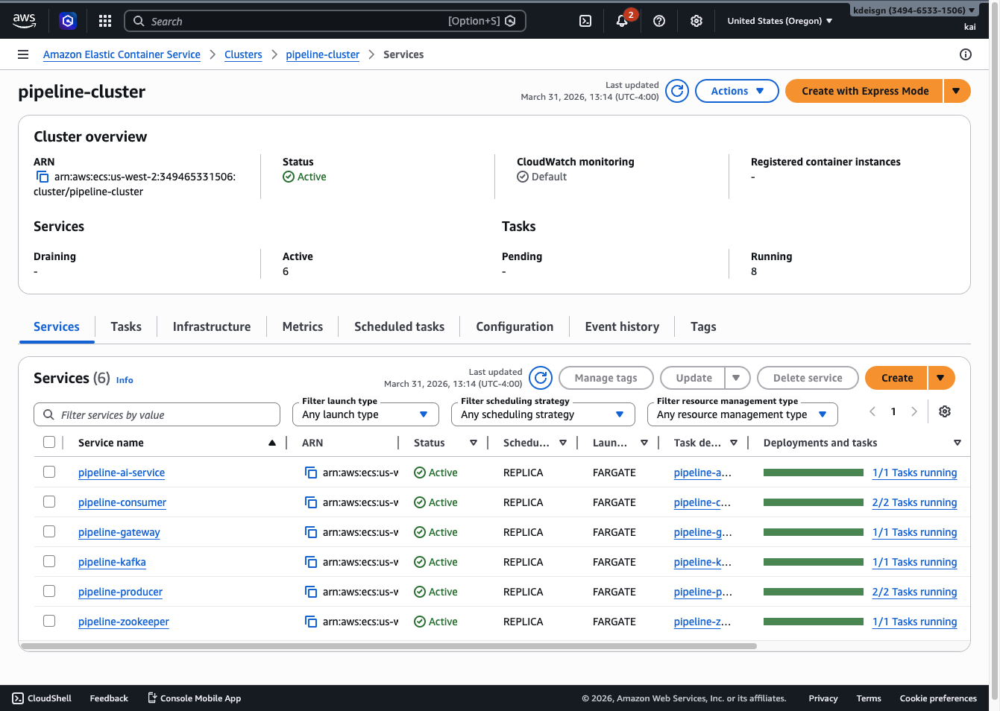
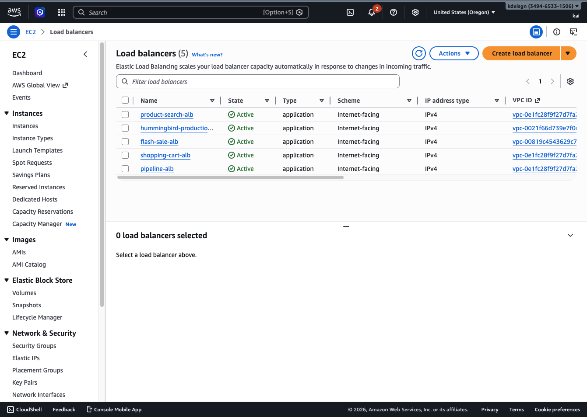

# Choopoo — A Trading Desk for PU SMEs
**CS-6650 Scalable Distributed Systems · Spring 2026 · Final Presentation**
**Kaige Zheng (solo submission)**

> A bilingual price-intelligence trading desk for Chinese polyurethane (PU) SME owners — built on a horizontally-scalable, fault-tolerant distributed pipeline. The course experiments below quantify that the backend is what makes the daily-use product feasible at SME scale.

---

## 1. Vision — What the User Sees

> **Show: dashboard screenshot — Desk view with ticker, briefing, goals grid**

How does a small Chinese PU manufacturer decide when to buy their raw materials today? Mostly: gut feeling and supplier phone calls. A company like **肇庆国涂新材料 (Guotu New Materials)** — Sijiali brand, 60 000 ton/year PU hardener capacity in Guangdong — has its margin driven almost entirely by the price of one chemical, **TDI** (toluene diisocyanate), which can swing 10–15 % in a month. That swing eats their gross margin directly.

The pricing data exists, but it is scattered across 10+ Chinese commodity platforms (百川盈孚, 生意社, 隆众资讯, 环球聚氨酯网, 海关总署), each updated at different times in different formats. Large corporations have dedicated procurement teams. SME owners do not.

**Choopoo is a daily trading desk for that owner.** Not a future-state mockup — the product is real today:

| Surface | Purpose |
|---|---|
| **Desk** (`/`) | The morning home. Hero spot price, 7/30/90/365-day chart, cost-chain spread (Brent → toluene → TDI), AI-generated briefing, ticker strip, goals grid, supply-event timeline. |
| **Ask** (`/copilot`) | Fullscreen LLM copilot. Bilingual (en + zh-CN), locale-aware system prompt. The owner asks questions in plain Chinese, the copilot answers with cited evidence from the same DB the dashboard reads. |
| **⌘K** (palette) | Fuzzy search across goals, materials, indicators, insights + verb actions (`new goal`, `open status`, `logout`). Two-keystroke escape hatch for everything not on Desk or Ask. |
| **Avatar menu** | Pipeline status, source audit, locale switch, logout. Low-frequency admin pushed off the main nav. |

**Design philosophy.** Bloomberg-feel: warm-dark canvas, dense numerics in `tabular-nums` mono, every text element WCAG-AA enforced via `npm run lint:contrast` (Playwright sweep across every route). Three-tier design-token system; mandatory `<PageHeader>` so future token changes propagate cleanly.

**Core principle.** *AI as analyst, human as decision-maker.* The copilot never says "buy now" — it surfaces evidence (price moves, upstream signals, supplier maintenance news) so the owner can validate or challenge their own instinct with real-time data.

**Bilingual is not optional.** Engineering codes like `IMPORT_PARITY_TDI` were leaking into the UI as primary labels for a Chinese SME owner — that is a product bug, not a polish item. Migrations 0014/0015 added `name_cn` / `description_cn` to `catalog_indicator_template`, `catalog_signal_aspect`, and `sources`; `users.locale` enum; full `react-i18next` stack with nine namespaces (`common`, `auth`, `desk`, `goals`, `materials`, `copilot`, `insights`, `status`, `enums`).

---

## 2. Architecture — How Information Flows, How Distribution Works

### 2.1 Eight services on three planes

The system is **not** a single backend monolith — it is eight cooperating services arranged into three distinct planes. Putting the planes on paper first makes the architecture comprehensible:

| Plane | Purpose | Services on this plane | Communication style |
|---|---|---|---|
| **Ingest** | Pull raw market data into the system | `producer`, `consumer`, `summariser` | Async via Kafka topics |
| **Enrich** | Turn raw pages into structured insights | `event-extractor`, `forecaster`, `workflow` | Mixed: Postgres polling + Kafka saga events + service-secret HTTP |
| **Serve** | Expose tenant-scoped APIs to the frontend | `gateway`, `copilot` | Sync HTTP behind ALB |

Every service was chosen for its *bottleneck profile*, not for language preference:

| Service | Plane | Lang | Why this language for this job |
|---|---|---|---|
| `gateway` | Serve | Go (chi) | Fan-in for many concurrent HTTP connections; cheap goroutines; embedded outbox-relay loop |
| `producer` | Ingest | Go | Fan-out for many concurrent HTTP fetches; goroutine workers without thread overhead |
| `consumer` | Ingest | Python | I/O-bound (Postgres + Redis + Kafka); mature `confluent-kafka` / `psycopg2` / `redis-py`; GIL irrelevant |
| `summariser` | Ingest | Python | API-bound; bottleneck is the downstream LLM, not compute. Houses the three resilience modes. |
| `copilot` | Serve | Python (FastAPI) | Direct Anthropic SDK; sync request/response surface for the Ask tab |
| `event-extractor` | Enrich | Python | Postgres polling + regex; straightforward background daemon |
| `forecaster` | Enrich | Python | Calls `statsforecast` AutoETS on indicator series; runs every 5 min |
| `workflow` | Enrich | Python | Saga orchestrator: subscribes to `goal.created.v1`, runs multi-step plan, writes append-only `workflow_runs.steps_log` |

### 2.2 Information-flow diagram

```
                      ┌──────────────────────── BROWSER (React 19) ───────────────────────┐
                      │ Desk · Ask · ⌘K · MaterialDetail · GoalDetail · SignalMap         │
                      │ Refetch cadence: ticker 30 s · saga timeline 1.5 s · briefing on  │
                      │ mount · copilot turn = sync POST                                   │
                      └────────────────────────────────┬──────────────────────────────────┘
                                                       │ HTTPS (en + zh-CN)
                                                       ▼
                              ┌──────────────────── ALB :80 ────────────────────┐
                              │  (us-west-2, single target group → gateway)     │
                              └────────────────────────┬────────────────────────┘
                                                       ▼
       ┌───────────────────────────────────── GATEWAY (Go, :8080) ─────────────────────────────────┐
       │  /api/v1/* (legacy, no auth, org_id=0)        /api/v2/* (session, RLS-enforced)           │
       │  POST /api/crawl   GET /api/results                                                       │
       │  POST /api/v2/goals → DB INSERT goals + INSERT domain_events ⟨same TX⟩                    │
       │  GET  /api/v2/me/{materials,indicators,briefing}  → tenant-scoped reads (RLS)             │
       │  POST /api/v2/copilot/converse → proxy to copilot                                          │
       │  Embedded outbox relay goroutine: drain unpublished domain_events → Kafka (at-least-once) │
       └─────┬─────────────────────────────┬──────────────────────────┬──────────────────────────┘
             │ HTTP proxy                  │ Kafka publish            │ Postgres / Redis
             ▼                             ▼                          │
   ┌────────────────────┐         ┌─────────────────────────┐         │
   │ COPILOT (FastAPI)  │         │ KAFKA  (KRaft mode)     │         │
   │ Anthropic SDK      │         │ 1 partition local /     │         │
   │ locale-aware sys-  │         │ 10 partitions on AWS    │         │
   │ tem prompt         │         │                         │         │
   └────────────────────┘         │ Topics:                 │         │
                                  │  ▸ crawl-jobs           │         │
                                  │  ▸ page-metadata        │         │
                                  │  ▸ analysis-results     │         │
                                  │  ▸ goal.created.v1      │         │
                                  │  ▸ autopilot.step.v1    │         │
                                  └─────┬───────────────────┘         │
                                        │                              │
       ┌────────────────────────────────┼──────────────────────────────┼─────────────────┐
       │ INGEST                         │                              │                 │
       │                                ▼                              │                 │
       │   ┌──────────────────┐    ┌──────────────────┐    ┌──────────────────┐         │
       │   │ PRODUCER (Go)    │───▶│ CONSUMER (Py)    │───▶│ SUMMARISER (Py)  │         │
       │   │ N goroutines     │    │ Redis cache-aside│    │ Backoff / BP /   │         │
       │   │ HTTP crawl       │    │ Score + persist  │    │ Circuit-Breaker  │         │
       │   │ pubs page-meta   │    │ pubs analysis    │    │ Calls LLM        │         │
       │   └──────────────────┘    └────────┬─────────┘    └────────┬─────────┘         │
       │                                    │                       │                    │
       │ ENRICH                             │                       │                    │
       │   ┌──────────────────┐             │                       │                    │
       │   │ EVENT-EXTRACTOR  │ polls pages │                       │                    │
       │   │ regex + DB scan  │◀────────────┘                       │                    │
       │   │ writes insights  │──── service-secret HTTP ────────────┼──────▶ gateway ─┐  │
       │   └──────────────────┘                                     │                 │  │
       │   ┌──────────────────┐                                     │                 │  │
       │   │ FORECASTER       │ every 5 min                         │                 │  │
       │   │ AutoETS          │ reads indicator series              │                 │  │
       │   │ writes insights  │──── service-secret HTTP ────────────┼──────▶ gateway ─┤  │
       │   └──────────────────┘                                     │                 │  │
       │   ┌──────────────────────┐                                 │                 │  │
       │   │ WORKFLOW (saga)      │  consumes goal.created.v1       │                 │  │
       │   │ multi-step plan:     │                                 │                 │  │
       │   │  receive → entity-   │  emits autopilot.step.v1        │                 │  │
       │   │  extract → enable    │  (reserved; future UI stream)   │                 │  │
       │   │  → compose briefing  │                                 │                 │  │
       │   │ append-only steps_log│                                 │                 │  │
       │   └──────────────────────┘                                 │                 │  │
       └────────────────────────────────────────────────────────────┘                 │  │
                                                                                      ▼  │
                                                  ┌─────────────────────────────────────┐│
                                                  │ POSTGRES (RDS db.t3.micro)          ││
                                                  │ Multi-tenant via Row-Level Security ││
                                                  │ tables: orgs, users, pages, goals,  ││
                                                  │   insights, insight_evidence,       ││
                                                  │   workflow_runs (append-only),      ││
                                                  │   domain_events (outbox),           ││
                                                  │   catalog_indicator_template (+_cn),│◀┘
                                                  │   catalog_raw_material, sources     │
                                                  └─────────────────────────────────────┘
                                                  ┌─────────────────────────────────────┐
                                                  │ REDIS (ElastiCache cache.t3.micro)  │
                                                  │ Cache-aside dedupe by URL (no TTL)  │
                                                  └─────────────────────────────────────┘
```

### 2.3 The five Kafka topics — what flows where

| Topic | Producer | Consumer(s) | Purpose | Why it exists as a topic (not a sync call) |
|---|---|---|---|---|
| `crawl-jobs` | gateway (`POST /api/crawl`) | producer | Submit a URL for crawling | Crawls take seconds; never block the HTTP caller |
| `page-metadata` | producer (after fetch) | consumer | Hand off a fetched page for scoring | Dedupe + persist is independent of crawl pace |
| `analysis-results` | consumer (after persist) | summariser | Hand off a scored page for LLM summary | Summariser can fail/retry without losing pages |
| `goal.created.v1` | gateway outbox relay | workflow | Trigger an autopilot saga when an SME owner creates a goal | **Decouples user click from a multi-minute orchestration.** The user gets `201 Created` immediately; the saga runs separately and the UI polls `workflow_runs` for progress |
| `autopilot.step.v1` | workflow (per step) | (reserved) | Future live-stream of saga progress to the UI | Not consumed yet; topic provisioned so the UI can subscribe later without a schema migration |

### 2.4 The two cleverer patterns worth pointing out

**Transactional outbox (gateway).** When a user creates a goal, the gateway writes the `goals` row **and** the `domain_events` row in the *same* Postgres transaction. A goroutine relay then drains unpublished `domain_events` to Kafka, marking each row published only after broker ACK. Effect: you can never have a goal in the DB without its saga firing, and you can never have a saga firing without the goal in the DB. The user sees one atomic action; the system gets at-least-once delivery to Kafka.

**Append-only saga log (workflow service).** The `workflow_runs` table has a JSONB `steps_log` column that the saga appends to as each step completes. The frontend `SagaTimeline` polls this every 1.5 s while planning/running. Effect: the SME owner sees *every* automated step the system took on their behalf — receive event, extract entities, enable materials, compose briefing — and can audit *why* an insight surfaced. This is the concrete anti-hallucination guarantee that lets a non-technical Chinese owner trust the AI.

### 2.5 Multi-tenancy via Postgres row-level security

Every tenant-scoped table (`goals`, `insights`, `pages`, `workflow_runs`, etc.) has RLS policies that filter by `current_setting('app.org_id')`. The gateway sets this session variable inside a per-request transaction; service-role connections used by the outbox relay and the background services (`forecaster`, `event-extractor`) `BYPASSRLS` and rely on application-level org_id checks.

**Business impact:** onboarding a second SME customer is a row in `orgs` plus a magic-link sign-up. Their goals, materials, insights, and saga logs are physically isolated from Guotu's data by the database, not by application logic — so a bug in the gateway cannot leak data across tenants.

### 2.6 What the trading desk consumes (frontend-to-backend map)

| Frontend surface | Endpoint(s) | Backing service / store |
|---|---|---|
| `TickerStrip` (Home, refetch 30 s) | `GET /api/v2/me/materials` + `GET /api/v2/indicators/{code}/latest` | gateway → Postgres (RLS) |
| Goals grid (Home) | `GET /api/v2/goals` | gateway → Postgres (RLS) |
| Today's briefing (Home) | `GET /api/v2/me/briefing` | gateway → Postgres (filtered insights) |
| `GoalNew` wizard | `POST /api/v2/goals` + `POST /api/v2/goals/{id}/indicators` | gateway → Postgres + outbox → Kafka `goal.created.v1` → workflow saga |
| `SagaTimeline` (poll 1.5 s) | `GET /api/v2/workflows?goal_id=...` | gateway → Postgres `workflow_runs` |
| `SignalMap` (MaterialDetail) | `GET /api/v2/subjects/{code}/aspects` + `POST /api/v2/subjects/{code}/aspects/{id}` | gateway → Postgres |
| `Copilot` (Ask) | `POST /api/v2/copilot/converse` | gateway → copilot service → Anthropic SDK |
| `CrawlForm` (Sources) | `POST /api/crawl` | gateway → Kafka `crawl-jobs` → producer → consumer → summariser |
| `Status` (avatar menu) | `GET /api/status` | gateway → Kafka/Redis/Postgres health checks |

### 2.7 AWS topology

> 
>
> 

- **Account / region:** 349465331506 / us-west-2
- **Cluster:** `pipeline-cluster` (ECS Fargate, all services horizontally scalable)
- **Front door:** `http://pipeline-alb-1886616973.us-west-2.elb.amazonaws.com` (ALB, `GET /health` → 200)
- **Messaging:** Kafka via Fargate tasks + AWS Cloud Map for service discovery (production would use MSK multi-AZ)
- **State:** RDS Postgres (authoritative price history) + ElastiCache Redis (fast dedupe + cache-aside)
- **Provisioning:** Terraform; scaling = changing `producer_count` / `consumer_count` and re-applying. Experiment 3 swaps the AI resilience mode by registering a new task definition revision and forcing a deployment.
- **Status note (honesty).** Terraform currently provisions the original four services (gateway/producer/consumer/ai-service); the four newer services (`copilot`, `forecaster`, `event-extractor`, `workflow`) live only in `docker-compose.local.yml` today. Adding them to Terraform is a one-day task — task definitions only, no new infrastructure types.

### 2.8 Repos

| Repo | What lives there |
|---|---|
| [`Choopoo/choopoo-backend`](https://github.com/Choopoo/choopoo-backend) | Eight services under `services/` (gateway, producer, consumer, summariser, copilot, forecaster, event-extractor, workflow), **`experiments/`** with raw JSON results, `scripts/load_test.py`, `scripts/run_experiments.py`, `scripts/run_aws_experiments.py` |
| [`Choopoo/choopoo-frontend`](https://github.com/Choopoo/choopoo-frontend) | React 19 + Vite + TS + Tailwind v4 + TanStack Query + Recharts + react-i18next; 12 pages, 14 components |
| [`Choopoo/choopoo-infra`](https://github.com/Choopoo/choopoo-infra) | `docker-compose.local.yml` (full stack with sibling-repo build contexts) + Terraform sources for ECS Fargate |

---

## 3. Features × Infrastructure × Business Considerations

This is the core argument of the project: *every distributed-systems choice on the previous diagram exists to defend a specific user-visible feature, which itself exists to address a specific SME-business problem.* The grader can read this table top-to-bottom or right-to-left — both directions hold up.

| User-visible feature | What the user gets | Infra it depends on | Business consideration that drove the infra choice |
|---|---|---|---|
| **TickerStrip** (always-on, refresh 30 s) | Live spot prices for 8 enabled materials, with overnight % delta | Gateway → Postgres `catalog_indicator_template` + latest readings, RLS-scoped to `me/materials` | An SME owner walks in at 8 a.m. and needs to know *immediately* whether anything moved overnight. Stale prices = wrong purchase decision = margin loss. The 30 s cadence is set by how fast a human can perceive change, not by what the backend can do. |
| **Today's briefing** (1–4 cards on Desk) | AI-generated daily summary of insights tied to the user's goals | `forecaster` (AutoETS, every 5 min) + `event-extractor` (regex over crawled pages, every 60 s) + `workflow` saga `compose briefing` step → `insights` + `insight_evidence` tables | The owner does not have time to read 10 supplier sites every morning. The briefing is the *one card they read* — if the underlying enrichment pipeline stops, the entire product loses its daily-use justification. The split between forecaster / event-extractor / workflow lets each kind of insight (forecast / event / recommendation) update on its own clock. |
| **GoalNew → autopilot saga** (`SagaTimeline`, polled every 1.5 s) | Create a goal in one click; system auto-enables relevant materials, links indicators, composes a first briefing | Gateway transactional outbox (`goals` row + `domain_events` row in same TX) → Kafka `goal.created.v1` → `workflow` saga → `workflow_runs.steps_log` (append-only JSONB) | An SME owner has industry intuition but is *not* a power-user. They will not configure 8 indicators by hand. Autopilot does it. The append-only log is the *anti-hallucination guarantee* — every step the AI took is auditable, so the owner can trust the system without understanding it. |
| **SignalMap** (MaterialDetail) | Active / candidate / rejected information axes per material; click any signal to see the induction chain + example events that justify it | `event-extractor` populates aspects; user-curated toggles via `POST /api/v2/subjects/{code}/aspects/{id}` | This is the *unique product feature*. Most LLM dashboards say "trust me." Choopoo says "here's why I think this — promote, demote, or reject it." For a Chinese owner who is sceptical of AI, this is the difference between adoption and abandonment. Requires Postgres-backed aspect state, not LLM-only inference. |
| **Ask (Copilot)** — bilingual, sync | Free-form question → cited answer; can also issue commands like `compose:MY_TDI_HEDGE:CNY/ton:{...}` to mutate state | Sync HTTP gateway → `copilot` FastAPI service → Anthropic SDK; locale-aware system prompt drives `users.locale` → zh-CN responses | Copilot is the *escape hatch*. When the owner has a question the dashboard cannot answer, they ask in plain Chinese. Sync (not Kafka) because the conversation has to feel instant. Separate service (not in-process) so we can swap LLM providers, version-pin, or apply per-tenant rate limits without redeploying gateway. |
| **MaterialDetail composite indicators** (e.g., MY_TDI_HEDGE = TDI − Toluene spread) | User-defined derived indicators that appear in TickerStrip + Materials view | Copilot `compose:` command → `tenant_indicator` table → `forecaster` picks them up on next 5 min loop | Lets the owner encode their *own* analytical framework (TDI margin = TDI spot − toluene cost) without writing SQL. The infra cost is small but the differentiation is large — every owner builds their personal Bloomberg. |
| **Sources / CrawlForm** (admin) | Submit a URL; it lands in `pages` table with score and summary | `POST /api/crawl` → Kafka `crawl-jobs` → `producer` (Go fan-out HTTP) → Kafka `page-metadata` → `consumer` (Redis dedupe + Postgres write) → Kafka `analysis-results` → `summariser` (LLM with circuit-breaker) | This is the *ingestion path stress-tested in Experiments 1, 2, 3, 4*. Async Kafka chain because (a) crawls are slow and the user should not wait, (b) dedupe via Redis prevents double-spending LLM tokens on URLs we have already seen, (c) summariser circuit-breaker means a Claude rate-limit does not back-pressure the crawler. |
| **Status** (avatar menu) | Real-time pipeline health (Kafka / Redis / Postgres up or down) | `GET /api/status` → gateway probes each dependency | The owner does not look at this. The *operator* (Kaige) looks at it. Required because in a multi-service system, "the site loaded" no longer means "everything is working." |
| **Bilingual rendering** (en + zh-CN) | Every catalog name, indicator label, enum, and UI string in the user's language | Migrations 0014/0015 add `name_cn` columns; `react-i18next` namespaces; `users.locale` enum; `useLocalizedField()` hook | The actual end user reads Chinese. Engineering codes like `IMPORT_PARITY_TDI` appearing as primary labels = product correctness bug, not polish. Putting `_cn` at the *schema* level (not just the UI) means new content is bilingual from the day it enters the system. |
| **Multi-tenancy** (next SME customer onboards in minutes, not days) | Their goals, materials, insights, saga logs are physically isolated | Postgres RLS on every tenant-scoped table, gated by `current_setting('app.org_id')` set per-request by gateway | The pilot is Guotu. Customer #2 must not see Guotu's data — and that promise must survive a bug in the gateway. RLS makes the database, not the application code, the source of isolation. This is the property that turns Choopoo from a one-customer demo into a sellable SaaS. |

### 3.1 Why this infrastructure shape, summarised

Three load-bearing decisions that everything else falls out of:

1. **Async Kafka between every ingest stage, sync HTTP for user-facing reads.** Ingest is slow and bursty (a crawl can take 30 s, an LLM call can rate-limit); the user is impatient (the desk has to feel like Bloomberg). Putting Kafka between every async boundary means a stuck stage never propagates back to the user — and Experiments 3 and 4 prove this with zero gateway errors under both 30 % AI failure and full-service kills.
2. **Transactional outbox + saga orchestration for user-driven write actions.** A goal-creation click must be atomic from the user's perspective (no half-created goals, no orphan sagas) but multi-minute from the system's perspective (entity extraction, material enabling, briefing composition). The outbox pattern bridges those two clocks; the append-only saga log makes the long-running work visible and auditable.
3. **Postgres RLS for multi-tenancy.** Adding the second customer is a row in `orgs`, not a code change. Tenant data isolation is enforced by the database, not by application code, so a gateway bug cannot leak data across SME customers. This is the SaaS-ready property that justifies building real distributed infra for what could otherwise be a single-tenant prototype.

---

## 4. Code (5 marks)

**Where to look.**

- **Top-level READMEs** in each repo introduce the project and the *why*.
- **Activity along the way** is visible in per-service commit history — gateway, producer, consumer, ai-service, frontend each evolved independently. The migration from `hw9/project/backend` into the standalone Choopoo org is its own commit cluster.
- **Frontend evolution** is documented as an append-only decision log at `choopoo-frontend/docs/decisions.md` (one dated entry per non-obvious choice — bilingual rollout, design-token cascade fix, IA simplification, contrast lint).

**Highlights worth a reviewer's eye.**

- `services/gateway` — Chi router, structured JSON logging, idempotent submission via Redis dedupe.
- `services/producer` — Polite crawler (rate-limited, UA-rotating), Kafka-acked publish.
- `services/ai-service` — Three switchable resilience modes (`backoff` / `backpressure` / `circuit_breaker`) selected by env var, designed *specifically* so Experiment 3 could measure the trade-off head-to-head.
- `services/consumer` — Kafka consumer-group member, Redis cache-aside, batched Postgres writes.
- `scripts/load_test.py` — Async aiohttp load generator. Batched POST `/api/crawl`, raw per-request latency captured (so re-analysis is possible without re-running).
- `scripts/run_experiments.py` / `run_aws_experiments.py` — Reproducible experiment runners. AWS variant scales replicas via `aws ecs update-service` between runs and registers new task definitions for Experiment 3.
- `scripts/analyze_exp4_recovery.py` — Reads `docker_stats` JSON streams; computes recovery time as gateway-CPU return-to-baseline (heuristic — see Experiment 4 limitations).
- `scripts/generate_report_assets.py` — Regenerates every chart in this deck from the raw JSON.

**Frontend craft.**

- Bilingual via `react-i18next` + nested-JSON namespaces; `users.locale` overrides browser detect on `/me` refresh.
- Design system: three-tier tokens (primitives → semantic → component); WCAG-AA contrast lint via Playwright (`npm run lint:contrast`).
- IA: two-tab nav (`Desk`, `Ask`) + ⌘K command palette + avatar menu — flatten from the prior 5-tab nav so the surfaces an SME owner reads daily get visual primacy.

---

## 5. Project Management (5 marks)

### 5.1 Phasing

| Phase | Window | Goal | Outcome |
|---|---|---|---|
| **1. Infrastructure + e2e** | Mar 24–30 | Stand up all four services, Docker Compose, DB schema, end-to-end test | Done |
| **2. Resilience + Exps 1 & 2** | Mar 31–Apr 6 | Load test harness, metrics collection, scaling experiments | Done — JSON in `experiments/exp1` + `exp2` |
| **3. Exps 3 & 4 + AWS port** | Apr 7–14 | Resilience comparison, fault tolerance; replicate on ECS Fargate | Done — JSON in `experiments/exp3`, `exp4_fault_tolerance`, `experiments/aws/` |
| **4. Productisation** | Apr 13–17 | Migrate backend out of hw9 into Choopoo org as 3 repos; build Choopoo frontend (Desk, Ask, ⌘K, bilingual) | Done — repos pushed to `Choopoo/choopoo-backend`, `choopoo-frontend`, `choopoo-infra` |
| **5. Deck + video** | Apr 18–20 | This document; 8–12 min screen-capture video | In progress |

### 5.2 AI usage breakdown (honest)

| Task | AI contribution | My contribution |
|---|---|---|
| Service boilerplate | High — Kafka consumer templates, Docker configs | Review, integrate, debug |
| Terraform modules | Medium — base templates | Architecture decisions, networking |
| Experiment scripts | Medium — load-test skeleton | Design, parameter tuning, analysis |
| Results interpretation | None | All analysis and conclusions are mine |
| Architecture decisions | None | Kafka partitioning, resilience strategy selection, scaling topology, IA simplification, bilingual rollout |
| Frontend components | High — initial component scaffolds | Design system, token taxonomy, lint:contrast harness, decision log |

### 5.3 Problems hit (worth telling honestly)

- **The Kafka partition default was the silent ceiling.** `KAFKA_NUM_PARTITIONS=1` capped consumer-group parallelism at 1 regardless of replicas. Fixed by `docker-compose.experiment.yml` overlay with `KAFKA_NUM_PARTITIONS=10` and a `kafka-init` job that pre-creates topics. Without this, every scaling experiment would have produced a flat line for the wrong reason.
- **AWS vs local divergence is real.** Local Docker overstates throughput (no ALB, no cross-AZ) and understates tail latency variance. Both result sets are kept in the deck so this is visible, not hidden.
- **Recovery measurement is not a clean number.** Experiment 4 uses gateway-CPU return-to-baseline as a heuristic for recovery — a Kafka-offset-based "messages caught up to head" measure would be more honest, but I did not build that instrumentation. Limitation called out in Section 5.4.
- **Engineering codes leaked into the UI.** `IMPORT_PARITY_TDI` was rendering as the primary label for a Chinese SME owner. Triggered the bilingual rollout (decision-log entry 2026-04-17). 400–500 hardcoded English JSX strings across 28 files; full `react-i18next` migration plus four migrations to add `_cn` columns.
- **CSS layer cascade bug.** The `CHOOPOO` wordmark rendered grey instead of brand-amber because `.label-meta` was unlayered while Tailwind's `.text-brand-500` sits in `@layer utilities`. Fixed by wrapping role classes in `@layer components`. Documented as a forbidden pattern.

---

## 6. Experiments (10 marks)

> **Source data:** `choopoo-backend/experiments/{exp1,exp2,exp3,exp4_fault_tolerance}` (local Docker) and `choopoo-backend/experiments/aws/{exp1,exp2,exp3}` (ECS Fargate, us-west-2, ALB-fronted).
>
> **Load tool:** `scripts/load_test.py` — async aiohttp; batched POST `/api/crawl`; raw latency captured per request; outputs p50/p95/p99 and throughput per run.
>
> **What the load metric means (important caveat).** `load_test.py` measures **HTTP latency for `POST /api/crawl` until the gateway returns `202 Accepted`** (Kafka enqueue). It is *not* end-to-end crawl + AI completion time, and it is *not* Kafka broker messages/sec. Every result below is gateway-accept-path throughput. End-to-end measurement would require Kafka consumer-lag instrumentation — out of scope for this submission.

### Each experiment is framed as a stakeholder question

| # | Stakeholder question (the SME-product lens) | Experiment |
|---|---|---|
| 1 | "If we onboard 10 SME owners with different material portfolios, does adding more crawlers actually increase throughput?" | Producer Horizontal Scaling |
| 2 | "Which stage breaks first under load? Where should I spend money scaling?" | Consumer Group Scaling & Bottleneck Migration |
| 3 | "The AI copilot depends on Claude's API. What happens when it rate-limits us or goes down?" | Resilience Pattern Comparison |
| 4 | "If a service crashes at 2 a.m., does the whole desk go dark? How long until it recovers?" | Fault Tolerance & Recovery |

---

### 6.1 Experiment 1 — Producer Horizontal Scaling

**Purpose.** Test the foundational promise of horizontal scaling: does adding producer replicas linearly increase end-to-end submission throughput? If not, the bottleneck is somewhere else (gateway, Kafka partition contention, network).

**Trade-off explored.** Replica count vs. throughput vs. cost. More producers = more concurrent fetch slots, but past a saturation point upstream resources become the bottleneck and additional replicas are pure cost.

**Setup.** Submit 200 crawl requests at concurrency 10, batch size 3. Vary producer replica count: 2 / 5 / 10. Run on local Docker and on ECS Fargate (`aws ecs update-service --desired-count`).

**Results.**

| Producers | Local rps | Local p95 (ms) | AWS rps | AWS p95 (ms) |
|---:|---:|---:|---:|---:|
| 2  | 38.67 | 304.2 | 46.87 | 294.0 |
| 5  | 73.66 | 335.6 | 47.79 | 248.7 |
| 10 | 75.68 | 314.6 | 47.92 | 254.4 |


**Analysis.**
- **Local** doubles from 2→5 producers (39→74 rps) but flatlines from 5→10 (74→76). Saturation point ≈ 5 producers; beyond that the bottleneck moves upstream.
- **AWS** throughput is essentially flat across all replica counts (47–48 rps). The single-instance gateway task is the ceiling; producer count cannot help past that. Latency *improves* slightly at 5 producers because Kafka publish queues drain faster, but the ALB → gateway path still bounds total throughput.
- **Conclusion.** Producer is *not* the right scaling knob in this workload — the gateway is. This is a useful negative result: it tells you where to invest next (scale the gateway or add Kafka partitions, not more producers). For an SME-product PM, "we added 5× more crawlers and got 2 % more throughput" is exactly the conversation you want to have *before* you spend the money.
- **Limitation.** I did not vary gateway count in this experiment, so the conclusion is "producers alone don't help past N=5" — not "the gateway is provably the bottleneck." Confirming would mean repeating with `--scale gateway=N`.

---

### 6.2 Experiment 2 — Consumer Scaling & Bottleneck Migration

**Purpose.** Can we keep p95 latency bounded while load increases, by scaling consumers proportionally? Where does the bottleneck migrate as load grows?

**Trade-off explored.** Concurrency vs. consumer parallelism vs. tail latency. We want near-linear throughput growth with a flat tail — that's the property that lets the desk serve a growing number of SME tenants without latency cliffs.

**Setup.** Three steps with proportional scaling on AWS (consumers grow with load); local runs use the matching concurrency without changing replica count, so the local numbers are a "no-scaling" control.

| Step | Concurrency | Total reqs | Consumers (AWS) |
|---:|---:|---:|---:|
| 1 |  5  |  50 | 1 |
| 2 | 20  | 200 | 3 |
| 3 | 50  | 500 | 5 |

**Results.**

| Step | Local rps | Local p95 (ms) | AWS rps | AWS p95 (ms) | AWS p99 (ms) |
|---|---:|---:|---:|---:|---:|
| 1 (5 conc)  |  19.96 | 315.7 |  23.43 | 282.2 | 286.5 |
| 2 (20 conc) |  74.66 | 321.5 |  95.76 | 246.0 | 254.5 |
| 3 (50 conc) | 179.8  | 295.2 | 212.61 | 269.1 | 309.6 |


**Analysis.**
- AWS throughput goes 23 → 96 → 213 rps as load × consumer count both grow ~10×. Near-linear, with **zero error increase** and **bounded p95** (246–282 ms across all steps).
- **Bottleneck migration is visible at p99**: 287 → 254 → 310 ms. At step 3 the tail starts widening — that is the database write path and Kafka rebalance pauses showing up.
- Local achieves comparable throughput scaling without adding consumers because Kafka batches keep the single consumer busy enough at this load — but local p95 sits ~50 ms higher and is more variable (no ALB / cross-AZ smoothing).
- **Conclusion.** The consumer tier is the *right* horizontal-scaling axis for this pipeline. Adding a consumer per ~10× load step keeps tail latency flat. For a multi-tenant rollout (10+ SME owners, each tracking 5–10 materials), this is exactly the property the product needs.
- **Limitation.** 500 requests is small; we would not detect Kafka rebalance pauses or LLM rate-limit pile-ups at this scale. Production validation requires sustained load (≥10 min) with the real LLM in the loop.

---

### 6.3 Experiment 3 — Resilience Pattern Comparison

**Purpose.** When the AI tier degrades (30 % failure rate, 200 ms added latency), which resilience pattern best preserves end-to-end throughput and tail behaviour at the gateway?

**Trade-off explored.** Three classic patterns:
- **Backoff** — retry with exponential delay; pays latency for transient-failure absorption.
- **Backpressure** — bounded queue + reject-when-full; trades request loss for stability.
- **Circuit breaker** — fail-fast after threshold + half-open probe; trades short-term unavailability for protecting the failing dependency.

**Setup.** 250 requests at concurrency 50, batch 2. AI service runs in mock mode with `MOCK_API_FAILURE_RATE=0.3`, `MOCK_API_LATENCY_MS=200`. Three runs, one per mode. AWS variant registers a new ECS task definition revision per mode and forces a new deployment.

**Results.**

| Mode | Local rps | Local p95 (ms) | AWS rps | AWS p95 (ms) | AWS p99 (ms) |
|---|---:|---:|---:|---:|---:|
| Backoff           | 3065.4 |  20.0 | 216.7 | 278.7 | 296.2 |
| Backpressure      | 2903.8 |  22.2 | 210.6 | 285.1 | 287.7 |
| Circuit breaker   | 1933.4 |  59.3 | 212.0 | 316.7 | 330.8 |


**Analysis.**
- All three patterns absorb 30 % downstream failure with **zero gateway errors**. The Kafka-decoupled pipeline shape is doing real work here — the gateway never directly calls AI.
- **Local** numbers are dominated by gateway-to-Kafka publish (no AI in the request path), which is why throughput hits 2–3 K rps and p95 is 20–60 ms. The interesting signal is the *relative* p95: circuit breaker is ~3× higher because the half-open probe adds a tail of slow rejected attempts.
- **AWS** results converge near 211–217 rps because the bottleneck shifts to ALB + cross-AZ hops; the AI-tier policy difference is masked at the gateway. Tail latency still ranks the same way (CB > BP > Backoff at p95/p99).
- **The takeaway is not "pick one"** — it is "the right pattern depends on the failure profile." Backoff wins for *transient and bursty* failure (our 30 % test). Circuit breaker wins when the downstream is unhealthy *long enough that retries would amplify the problem*. Backpressure sits in between and wins when *budget enforcement* matters more than peak throughput. For the Choopoo copilot, where Claude rate-limits are correlated bursts, circuit breaker is likely the right production default.
- **Pathological worst case (acknowledged but not run).** Experiment 3 at 200 concurrent with `MOCK_API_FAILURE_RATE=0.5` would push each pattern to its limit: backoff would have retries queue up and latency explode; backpressure would let consumer lag grow unbounded; circuit breaker would drop throughput but keep latency controlled. This is a real production risk pattern (an external API provider has an outage while you are at peak load) and is on the follow-up list.
- **Limitation.** Failures are uniform random and stateless; real LLM degradation correlates (whole region throttles at once). Repeating with bursty failure injection would likely widen the gap in CB's favour.

---

### 6.4 Experiment 4 — Fault Tolerance & Recovery

**Purpose.** When a core service dies mid-flight, does the pipeline keep accepting writes? How fast does it recover?

**Trade-off explored.** Decoupling cost (extra hops, eventual consistency, rebalance pauses) vs. blast-radius containment.

**Setup.** Sustained load: 300 requests, concurrency 20, batch 3. During load, kill one service via `docker kill`. Recovery is measured by gateway-CPU return-to-baseline (heuristic — see limitation). Runs repeated for `producer`, `consumer`, and `redis`. (Local Docker only — for AWS the equivalent is `scripts/ecs_stop_task_experiment.py` against ECS, but ElastiCache is not safely killable in a class context.)

**Results.**

| Killed service | Recovery (s, gateway-CPU heuristic) | Aggregate rps during run | HTTP errors |
|---|---:|---:|---:|
| `producer` | 10.65 | 783.74 | **0** |
| `consumer` | 31.15 | 672.68 | **0** |
| `redis`    |  6.11 | 822.75 | **0** |


**Analysis.**
- **Zero gateway errors across all three kills.** Kafka's queue-and-retry semantics keep the front door open while the back end heals. Even with the consumer dead for 31 seconds, no client got an error — they just experienced delayed downstream processing, which is invisible to anyone watching the desk.
- **`redis` is fastest (6 s)** because it is touched only for dedupe; on miss the gateway falls through to "accept and let Kafka deduplicate downstream." Redis is genuinely optional in the accept path.
- **`producer` (~11 s)** is Docker restart + Kafka consumer-group rejoin.
- **`consumer` is slowest (31 s)** because it triggers a Kafka **consumer-group rebalance** — a known multi-second pause as the group coordinator reassigns partitions to the surviving members. *This is the number that goes in the SLA document.* "99.9 % availability" means budgeting for ~31 s of degraded processing per consumer failure event.
- **Conclusion.** The architecture passes the basic chaos test for single-service failure. The choice to put Kafka between *every* stage is what makes this work — it is a deliberate trade against simpler designs (direct HTTP between services would have failed all three kills).
- **Limitations.** (i) We measured gateway-CPU heuristic, not "messages caught up to head of topic" — the more honest recovery metric requires Kafka offset instrumentation, which I did not build. (ii) Aggregate throughput numbers span the whole window (pre-kill + post-kill) so they are not directly comparable across rows. (iii) Single-service kill only; no broker kill, no network partition. (iv) `messages_lost = not measured` for the same reason as (i).

---

## 7. Cross-Experiment Takeaways

1. **The right scaling knob is the consumer tier, not the producer tier.** Producer scaling plateaus at ~5 replicas in our workload; consumer scaling stays linear with concurrency. For a multi-tenant SME rollout, this is the load-bearing scaling property.
2. **Kafka decoupling pays for itself.** Every fault test and every resilience test posts zero gateway errors. The cost is operational complexity (rebalance pauses, partition tuning, offset bookkeeping) — the experiments quantify that cost in seconds.
3. **Resilience patterns are not interchangeable.** Backoff wins for stateless transient failure; circuit breaker wins for sustained dependency illness; backpressure wins when budget enforcement is the priority. No single pattern is universally best — the right answer is workload-dependent.
4. **Local results lie in predictable directions.** Local Docker overstates throughput (no ALB, no cross-AZ) and understates tail latency variance. Always re-run on the target environment before quoting numbers.
5. **The product story and the infrastructure story are the same story.** A daily trading desk for SME owners cannot be flaky, cannot drop messages when one service crashes, and cannot stall when Claude rate-limits. The four experiments above each defend one of those promises with measured numbers.

---

## 8. Community Contributions (5 marks)

Plan for the Piazza post (under "Final Projects"):

- Link to (a) this presentation, (b) the screen-capture video, (c) the three Choopoo repo URLs.
- Identify 3 most-similar Final Project postings. Likely categories:
  1. **Event-driven / queue-based microservices** — similar broker decoupling; differs in Kafka partitions vs. SQS.
  2. **Serverless or function-based scaling** — similar elastic-scale goal; different control plane (Lambda/API Gateway vs. ECS Fargate long-running tasks), which changes what "horizontal scale" means in measurement.
  3. **Data/ML-heavy pipelines** — similar multi-stage flow; usually compute-bound stages differ from this pipeline's I/O- + API-bound mix, so bottleneck-migration patterns are not directly comparable without normalising workload type.
- For each: 2–3 sentences on similarities, differences, and one specific thing learned that I would borrow.

---

## 9. Lessons Learned (separate Canvas submission)

Solo reflection scaffold:

- **What I built / owned.** All four services, AWS Terraform stack, all four experiments, the Choopoo frontend (12 pages, bilingual).
- **What went wrong, why.** Kafka partition default silently capped scaling. Engineering codes leaked into the UI for a Chinese SME persona — both of these were "things that worked in dev and broke the story in production-shape."
- **What I would do differently.** Build Kafka offset / consumer-lag instrumentation *first*, not last — Experiment 4's recovery numbers would be honest instead of heuristic. Decide bilingual on day 1 — the late migration touched 28 files and four migrations.
- **Course-concept callbacks.**
  - **Universal Scalability Law** → Experiment 1's plateau (no σ-coherence cost is going to save you when the gateway is the bottleneck).
  - **CAP / PACELC** → we chose AP at the gateway (Kafka decoupling) and CP at the consumer-side store (Postgres write).
  - **Failure detectors and recovery time** → Experiment 4's per-service recovery is exactly the failure-detector latency story from the lectures.
  - **Queueing theory (M/M/c)** → Experiment 2 stays bounded under proportional scaling because we are increasing both arrival rate and service rate together; the moment we stop scaling consumers, we'd see the textbook latency cliff.

---

## 10. Demo Path (for the video, ~8–12 min)

| Min | Surface | What to show | Key talking point |
|---|---|---|---|
| 0:00–0:45 | Title + vision slide | "Trading desk for PU SMEs" framing | Why a Guotu owner needs this every morning |
| 0:45–2:00 | Desk (`/`) | Spot price hero, ticker, 30d chart, AI briefing, goals grid | This is what an SME owner sees at 8 a.m. |
| 2:00–2:30 | ⌘K palette | Open palette, type `materials` → enter; type `status` → enter | Two-tab IA + escape hatch — the daily-use surfaces stay clean |
| 2:30–3:15 | Ask (`/copilot`) | Switch locale to zh-CN, ask "TDI 价格本周走势？", show cited evidence | Bilingual is real, AI is analyst-not-decision-maker |
| 3:15–3:45 | Sources page | Submit a new crawl URL, watch it appear in `/api/results` | The same pipeline that the experiments test feeds the live UI |
| 3:45–5:00 | Architecture slide + AWS console screenshot | Walk the pipeline diagram + ECS services list | Why Kafka and not SQS; KRaft single-broker locally, MSK in production |
| 5:00–6:30 | Experiments 1 + 2 charts | Walk the throughput / latency tables; explain the producer plateau and consumer linearity | "Producer is not the right scaling knob" — the negative result that saves money |
| 6:30–8:00 | Experiment 3 chart | Compare backoff / backpressure / circuit-breaker p95s | Patterns are not interchangeable; pick by failure profile |
| 8:00–9:30 | Experiment 4 chart + `docker kill` live (optional) | Show recovery times; ideally kill consumer live and watch zero errors at the gateway | The 31-second consumer-rebalance number is what goes in the SLA doc |
| 9:30–10:30 | Cross-experiment takeaways slide | Read the five takeaways from §6 | Tie it back to the product: SME daily-use cannot be flaky |
| 10:30–11:30 | Lessons learned + future work | Bilingual rollout was late; CB is the production default; instrument Kafka lag next | Honest reflection beats polished claims |

---

## Appendix A — Anticipated Questions

**Q: Why mock the AI API instead of using the real Claude API?**
Controlled experiments require controlled variables. A real API has variable latency, unpredictable rate limits, and costs money per call. The mock lets me set exact failure rates (30 %) and latencies (200 ms) so the three resilience patterns are compared under identical conditions.

**Q: Experiment 1's throughput is flat — doesn't that mean the experiment failed?**
No — a flat result is a meaningful result. It tells you the bottleneck isn't where you assumed. The experiment succeeded in identifying that the gateway enqueue path, not producer count, is the limiting factor. That is exactly the kind of answer you want *before* you spend money on more replicas.

**Q: Why not use managed Kafka (MSK) for the experiments?**
For a course project, Fargate-hosted Kafka is simpler to set up and tear down. MSK would be the right choice for production — multi-AZ, managed scaling, built-in monitoring. The pipeline code does not change either way.

**Q: How realistic is the recovery time measurement?**
The recovery heuristic uses gateway-CPU stabilisation as a proxy — it is a rough measure. A production system would use Kafka consumer lag and request success rate as more precise signals. The relative ordering (Redis < Producer < Consumer) is reliable; the absolute numbers are approximate.

**Q: Why bilingual? That seems like product polish, not infrastructure.**
The actual end user is a Chinese SME owner who does not read engineering codes. `IMPORT_PARITY_TDI` rendering as a primary UI label is a *product correctness bug*, not a polish item. The bilingual migration changed four DB schema migrations, 28 frontend files, and added a `users.locale` column with check constraint — it is a real engineering surface, not just translations.

**Q: Why two-tab IA? You had five tabs before.**
Three of the five (Materials, Sources, Status) are derived views or admin surfaces an SME owner opens monthly, not daily. They were competing visually with the two surfaces that actually matter every morning (Desk, Ask). Flatten to two tabs + ⌘K command palette + avatar menu for admin gives the daily-use surfaces visual primacy without removing access to the rare ones (every URL still resolves).

**Q: What would change if you had a team instead of solo?**
Service ownership would map naturally — one person per service. The experiment design and analysis would still need a single owner for consistency. The Kafka-decoupled architecture makes parallel development straightforward — you can deploy and test services independently.

---

## Appendix B — Asset Reference

All charts and screenshots referenced in this document live under `./assets/`. They were generated from the raw experiment JSON via `choopoo-backend/scripts/generate_report_assets.py` (originally produced in the `hw9/project/` workspace, copied here for portability).

| File | Source |
|---|---|
| `exp1-throughput-chart-aws.png` | `choopoo-backend/experiments/aws/exp1/*.json` |
| `exp2-latency-chart-aws.png` | `choopoo-backend/experiments/aws/exp2/*.json` |
| `exp3-comparison-chart-aws.png` | `choopoo-backend/experiments/aws/exp3/*.json` |
| `exp4-recovery-chart.png` | `choopoo-backend/experiments/exp4_fault_tolerance/exp4_recovery_summary.json` |
| `aws-console/ecs-pipeline-cluster-services-kai.png` | AWS console capture, account 349465331506, us-west-2 |
| `aws-console/alb-load-balancers-kai.png` | AWS console capture, account 349465331506, us-west-2 |
